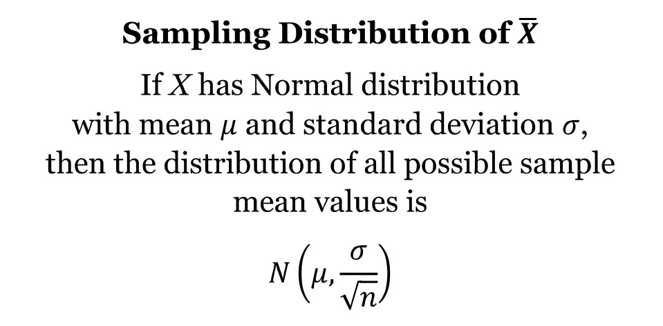
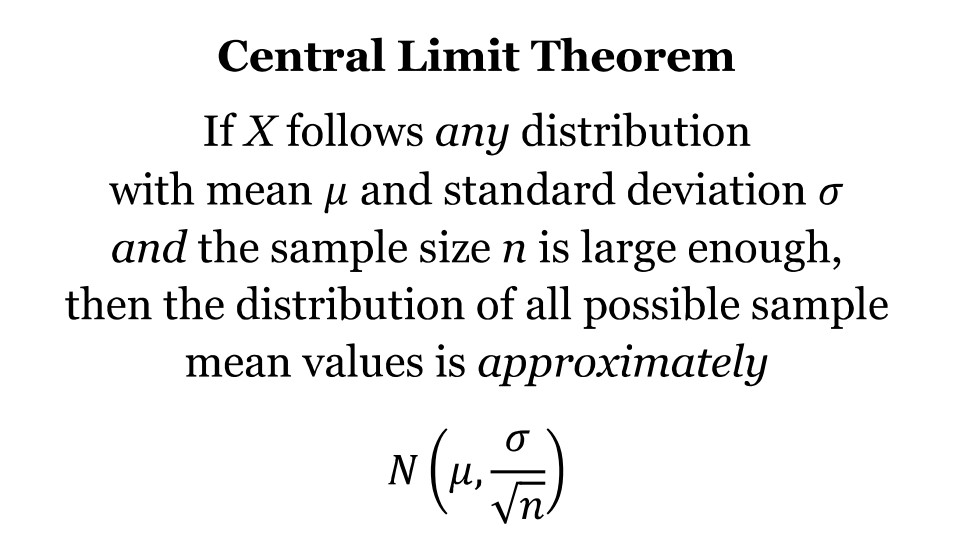
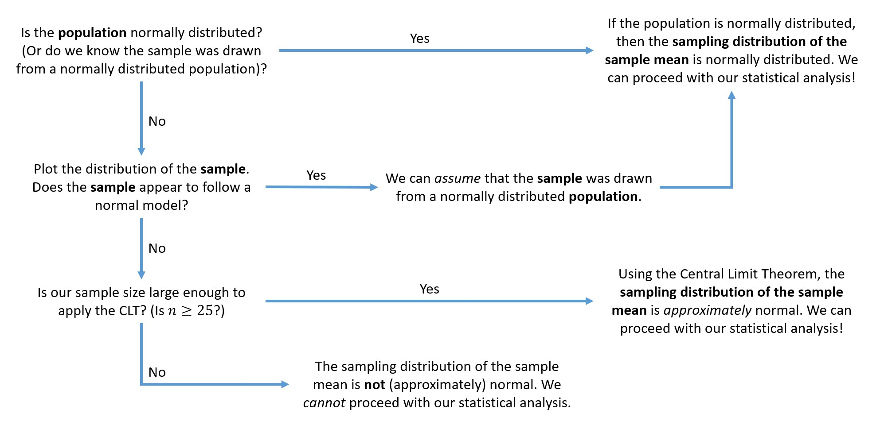
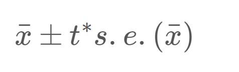
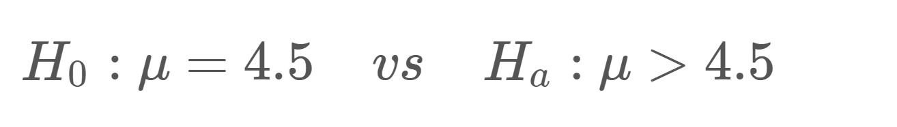

```{r setup, include = FALSE}
knitr::opts_chunk$set(echo = TRUE)
```

### Learning Objectives
1. Review properties for the sampling distribution of the sample mean
2. Understand when to apply the Central Limit Theorem (CLT)
3. Check for normality using histograms and QQ plots
4. Estimate a population mean with a confidence interval
5. Carry out a hypothesis test for a population mean


***


## Statistical Review

### Sampling Distribution of Xbar

As we have seen many times this semester, the value of a statistic varies from sample to sample. Because the values vary from sample to sample, we can create a sampling distribution for the statistic. This allows us to see how all possible values of that statistic would fall for repeated samples of the same size. 

In this lab, our statistic is a sample mean and our sampling distribution is the "sampling distribution of the sample mean". Knowing the center, spread, and shape of this sampling distribution helps us create confidence intervals and run hypothesis tests for a population mean! 

Let's review some properties for this sampling distribution.

{width=400px}

These formulas tell us that the *center* of the sampling distribution is equal to the population mean and the *spread* of the sampling distribution decreases as the sample size increases. (We simulated these ideas in Lab 5.) 

What can we say about the *shape* of this sampling distribution? Is it normal or approximately normal? How can we tell? 

{width=450px}

If the *population distribution* is normal, then the *sampling distribution* of the sample mean is normal. This is true regardless of the sample size! 

So if we plot the *population distribution* and the population distribution is normal, then the sampling distribution of the sample mean will be normal as well. 

Can we plot the population distribution? Sometimes...but most of the time we only have a *sample* of data (instead of the entire population of data). 

If we can't plot the population distribution, what do we do? We can plot the *sample distribution* and make assumptions (suggestions) about the population distribution.

If the *sample distribution* appears to follow a normal model, then it is reasonable for us to suggest that this sample was drawn from a *population distribution* that is normal. And if we can suggest that the *population distribution* is normal, then we can also suggest that the *sampling distribution of the sample mean* is normal! 

Take a moment to digest the above paragraph - it can be a lot to take in. We discuss all three of our distributions (population distribution, sample distribution, and sampling distribution) in one idea. 


### Central Limit Theorem (CLT)

What if it is *not* reasonable to suggest that our sample of data was drawn from a normally distributed population? We might be able to rely on the Central Limit Theorem to help us! The CLT states:

{width=400px}  

So what is large enough? We use the general rule of thumb that the sample size must be at least 25.

If our sample size is at least 25, then the *sampling distribution of the sample mean* will be approximately normal - even if we weren't able to assume that the population distribution was normal.

Think of the Central Limit Theorem as a "back-up plan". When we cannot assume that our sample of data was drawn from a normally distributed population, we can use the CLT if we have a large enough sample size! 

This can certainly get confusing so we created a road map for checking the normality assumption.



*Think About It:* True or False? - In order for the sampling distribution of the sample mean to be normal (or approximately normal), the sample size must be at least 25.

Now is a great time to ask questions!


## Coding Examples

### Load Packages

Before we get started, be sure to load the following packages. 

```{r load_packages}
library(ggplot2)
```

If you don't run this code chunk, some of the code chunks below will not run!


### Histograms and QQ Plots

In this lab, we will be using data from NHANES - the National Health and Nutrition Examination Survey. This is a program of studies designed to assess the health and nutritional status of adults and children in the United States. You can find more information about NHANES [here](https://www.cdc.gov/nchs/nhanes/about_nhanes.htm). 

NHANES is a very extensive data set, but we have filtered it down to a random sample of 82 participants and a set of ten variables, described below. 

- `height`: height (in cm)
- `weight`: weight (in kg)
- `BMI`: body mass index (in kg/m^2)
- `arm`: arm circumference (in cm)
- `chol`: cholesterol level (in mg)
- `iron`: iron level (in mg)
- `hgb`: hemoglobin (in g/dL)
- `caffeine`: caffeine amounts (in mg)
- `rbcc`: red blood cell count (in millions of cells/uL)
- `wbcc`: white blood cell count (in millions of cells/uL)

Let's read in the data using the code chunk below.

```{r read_nhanes_data}
nhanes <- read.csv("nhanes_sample.csv")
```

And here's a quick preview of the data.

```{r preview_nhanes_data}
head(nhanes)
```

Notice that all of these variables would be considered *quantitative*. Also notice that we only have a *sample* of data, a subset of all NHANES participants. 

Suppose we want to construct a confidence interval or run a hypothesis test for the average height of all NHANES participants. One of the first steps of our analysis is checking the normality assumption.

We have two plots that can help us check for normality. The first is a histogram, which we've seen many times before.

```{r histogram_height}
ggplot(data = nhanes, aes(x = height)) +
  
  geom_histogram(bins = 10, color = "black", fill = "grey80") +
  
  labs(title = "Histogram of Heights",
       subtitle = "for a SAMPLE of 82 NHANES participants",
       x = "Height (in cm)",
       y = "Frequency")
```

From the histogram, we would conclude that the sample distribution appears to follow a normal model. The distribution is unimodal, symmetric, and has a bell-shaped pattern.

The second plot that is commonly used to check for normality is called a **QQ plot** (or quantile-quantile plot). This graph plots our sample data against a theoretical normal distribution. 

In order to conclude that our sample of data appears to follow a normal model, *we want to see that the overall pattern of our observations roughly follows the identity line* produced by the plot. Let's see what we're talking about.

To create a QQ plot, we'll use the `ggplot()` function and include `stat_qq()` *and* `stat_qq_line()`. One very important change is that with this code, we use `sample` in the `aes()` argument, instead of `x`. 

**IMPORTANT NOTE:** We use `aes(sample = height)` instead of `aes(x = height)`

Let's see what the QQ plot for the heights data looks like. 

```{r qq_plot_heights}
ggplot(data = nhanes, aes(sample = height)) + 
  
  stat_qq() +
  stat_qq_line() + 
  
  labs(title = "QQ Plot of Heights",
       subtitle = "for a SAMPLE of 82 NHANES participants",
       x = "Theoretical Quantiles",
       y = "Sample Quantiles")
```

This is an ideal looking QQ plot! The overall pattern of our observations roughly follows the identity line. There are no *major* deviations from the line or *obvious* patterns in the data. 

From either the histogram or the QQ plot, we would make the following conclusions:

**1. Observations about the sample:** what can we conclude about the sample distribution? 

- From the histogram, we observed that the sample distribution of heights was unimodal and approximately symmetric (normal). 
- From the QQ plot, we observed that the overall pattern of our sample data roughly followed the identity line, indicating a normal distribution.

**2. Conclusion about the population distribution:** based on the sample distribution, what is reasonable to conclude about the population distribution?

- We can suggest the shape of the population distribution of heights for all NHANES participants is likely unimodal and symmetric (normal).

**3. Conclusion about the sampling distribution:** based on the population distribution, what is reasonable to conclude about the sampling distribution?

- Since the population distribution of responses is normal, we can suggest that the shape of the distribution of all sample mean values (i.e., the sampling distribution of the sample mean) is unimodal and symmetric (normal).


What would the QQ plot look like for non-normal (skewed) data? Let's analyze the cholesterol levels (`chol`) for our sample of 82 NHANES participants. 

**Demo #1:** Create a QQ plot for the cholesterol level variable (`chol`). Feel free to copy, paste, and edit the code from the code chunk above! Be sure to update your plot title, but the axis labels can stay the same! We can always use "Theoretical Quantiles" for the x-axis label and "Sample Quantiles" for the y-axis label. 

```{r demo1, error = T}
# Replace this text with your code

```

In this QQ plot, the overall pattern of our sample data pulls away from the identity line in a clear manner. We would conclude that this sample distribution does *not* follow a normal model. 

What would the corresponding histogram look like?

```{r histogram_cholesterol}
ggplot(data = nhanes, aes(x = chol)) +
  
  geom_histogram(bins = 20, color = "black", fill = "grey80") +
  
  labs(title = "Histogram of Cholesterol Levels",
       subtitle = "for a SAMPLE of 82 NHANES participants",
       x = "Cholesterol Level (in mg)",
       y = "Frequency")
```

We see that the distribution of cholesterol levels for a sample of 82 NHANES participants is unimodal, but not symmetric. The sample distribution is heavily skewed to the right. 

From either the histogram or the QQ plot, we would make the following conclusions:

**1. Observations about the sample:** what can we conclude about the sample distribution? 

- From the histogram, we observed that the sample distribution of cholesterol levels was skewed to the right. 
- From the QQ plot, we observed that the overall pattern of our sample data did not follow the identity line, indicating a non-normal distribution.

**2. Conclusion about the population distribution:** based on the sample distribution, what is reasonable to conclude about the population distribution?

- We can suggest the shape of the population distribution of cholesterol levels for all NHANES participants is likely skewed to the right (or non-normal).

**3. Conclusion about the sampling distribution:** based on the population distribution, what is reasonable to conclude about the sampling distribution?

- Since the sample size is large enough (at least 25), however, we can suggest that the shape of the distribution of all sample mean values (i.e., the sampling distribution of the sample mean) is unimodal and symmetric (normal).


**THINK-PAIR-SHARE:** Consider the following plots for red blood cell count and caffeine amount. For each variable, make conclusions about the sample distribution, population distribution, and sampling distribution. 

Note: you do not have to fill out the conclusions for each plot below, but we've added the three steps below each plot if you'd like to leave yourself notes!

```{r histogram_red_blood_cell_count}
ggplot(data = nhanes, aes(x = rbcc)) +
  
  geom_histogram(bins = 15, color = "black", fill = "grey80") +
  
  labs(title = "Histogram of Red Blood Cell Counts",
       subtitle = "for a SAMPLE of 82 NHANES participants",
       x = "Red Blood Cell Count (in millions of cells/uL)",
       y = "Frequency")
```

```{r qq_plot_red_blood_cell_count}
ggplot(data = nhanes, aes(sample = rbcc)) + 
  
  stat_qq() +
  stat_qq_line() + 
  
  labs(title = "QQ Plot of Red Blood Cell Counts",
       subtitle = "for a SAMPLE of 82 NHANES participants",
       x = "Theoretical Quantiles",
       y = "Sample Quantiles")
```

**1. Observations about the sample:** what can we conclude about the sample distribution? 

**2. Conclusion about the population distribution:** based on the sample distribution, what is reasonable to conclude about the population distribution?

**3. Conclusion about the sampling distribution:** based on the population distribution, what is reasonable to conclude about the sampling distribution?


```{r histogram_caffeine}
ggplot(data = nhanes, aes(x = caffeine)) +
  
  geom_histogram(bins = 10, color = "black", fill = "grey80") +
  
  labs(title = "Histogram of Caffeine Amounts",
       subtitle = "for a SAMPLE of 82 NHANES participants",
       x = "Caffeine Amount (in mg)",
       y = "Frequency")
```

```{r qq_plot_caffeine}
ggplot(data = nhanes, aes(sample = caffeine)) + 
  
  stat_qq() +
  stat_qq_line() + 
  
  labs(title = "QQ Plot of Caffeine Amounts",
       subtitle = "for a SAMPLE of 82 NHANES participants",
       x = "Theoretical Quantiles",
       y = "Sample Quantiles")
```

**1. Observations about the sample:** what can we conclude about the sample distribution? 

**2. Conclusion about the population distribution:** based on the sample distribution, what is reasonable to conclude about the population distribution?

**3. Conclusion about the sampling distribution:** based on the population distribution, what is reasonable to conclude about the sampling distribution?


Check out the Lab 6 Slides (posted in Canvas under Files > Lab Material) for more examples of QQ plots for normal and non-normal sample data.


### The t-Distribution

If we can assume that the sampling distribution of the sample mean is either normal or approximately normal, we can proceed with our statistical analysis using the t-distribution.

The t-distribution is a symmetric, unimodal distribution that is centered at 0. It is very similar to the standard normal distribution, but has heavier (or wider) tails depending on the degrees of freedom. These wider tails will give us more conservative tail probabilities. 

This distribution is used when the true standard deviation (sigma) is unknown. Instead, we use the sample standard deviation (s) as an estimate of the population standard deviation to compute the *standard error* of xbar. Because we are using an estimate of the spread, we will utilize this slightly wider (more conservative) distribution for any statistical inference procedures.  


### Confidence Intervals

A confidence interval provides us with a range of reasonable values for an unknown parameter. In the following scenarios, the parameter of interest is the population mean (mu). When we don't know the value of this parameter, we can *estimate* it using the sample mean (xbar). With this estimate, we add some margin of error (or "wiggle room") to create a confidence interval. 

The equation for our confidence interval is:

{width=180px}

We can use the `t.test()` function to create this interval. Using the NHANES data, let's create a 90% confidence interval that estimates the population mean height of NHANES participants. To do this, we need to specify two arguments: 

- the variable of interest (`dataset$variable`)
- the confidence level (`conf.level`)

Let's see an example:

```{r confidence_interval_example}
t.test(nhanes$height, conf.level = 0.90)
```

Right away, the output seems strange because we get a test statistic and a p-value. **You should ignore this.** We specified inputs to create a confidence interval, so we should only look at the second half of the output. 

The 90% confidence interval is (165.5342 cm, 169.2487 cm). We estimate, with 90% confidence, that the population mean height of NHANES participants is between 165.53 and 169.25 centimeters.

**Demo #2:** Create a *99%* confidence interval that estimates the average cholesterol level of all NHANES participants.

```{r demo2, error = T}
# Replace this text with your code

```

Think About It: True or False? To create this confidence interval, a t* multiplier of 9.6766 was used (as shown in the output). 


### Multipliers

If we wish to calculate the t* multiplier, we can use the `qt()` function. This function takes three arguments:

- `p`: this value should be half of the leftover area (more info below)
- `df`: the degrees of freedom
- `lower.tail`: we will always set this argument to FALSE

What do we mean by "half of the leftover area"? If we want to create a 90% confidence interval, then our "leftover" area is 10% and half of this is 5% - or 0.05.

```{r multiplier_example1}
qt(p = 0.05, df = 81, lower.tail = FALSE)
```

This multiplier was used in creating the 90% confidence interval for the population mean height. 

If we want to create a 99% confidence interval, then our "leftover" area is 1% and half of this is 0.5% - or 0.005.

```{r multiplier_example2}
qt(p = 0.005, df = 81, lower.tail = FALSE)
```

This multiplier was used in creating the 99% confidence interval for the population mean cholesterol level (in Demo 2). 


**Demo #3:** Find the t* multiplier used to create the *95%* confidence interval for the population mean cholesterol level for all NHANES participants. 

```{r demo3, error = T}
# Replace this text with your code

```

The `t.test()` functions computes this automatically when creating the confidence interval. But you might need this code if you were to create the interval by hand.


### Hypothesis Testing

A hypothesis test helps us judge whether or not a statement about a population is reasonable or not. The procedure for running any hypothesis test involves four steps:

1. Determine appropriate null and alternative hypotheses 
2. Check the assumptions for performing the test  
3. Calculate the actual statistic and corresponding test statistic. Then, determine the p-value.
4. First, evaluate the p-value and determine the amount of evidence against the null hypothesis. Then, make a conclusion in the context of the problem.

Our parameter of interest is the population mean (mu). When setting up the hypotheses, we have three options.

{width=340px}

Suppose it is currently believed that individuals have 4.5 million red blood cells per microliter (uL), on average. A medical researcher, however, believes that the true mean red blood cell count is actually *greater* than this value. We could use our NHANES data to test the following hypotheses:

{width=340px}

To run this hypothesis test, we use the `t.test()` function again, but have three arguments to specify:

- variable of interest (`dataset$variable`)
- `mu`: hypothesized value of mu
- `alternative`: alternative hypothesis ("less", "greater", or "two.sided")

Note: these are different than the ones we used to create a confidence interval! Our code for a hypothesis test would look like this:

```{r hypothesis_test_example}
t.test(nhanes$rbcc, mu = 4.5, alternative = "greater")
```

Again, our output is a little strange because we get information for a confidence interval. **You should ignore this.** We specified inputs to run a hypothesis test, so we should only look at the first half of the output. 

The first half of this output tells us:

- the t-test statistic (3.1778)
- the degrees of freedom for the t-distribution (81)
- the corresponding p-value (0.001051)

**Evaluation:** With a p-value of 0.001051, there is very strong evidence against the null hypothesis and in support of the alternative hypothesis.

**Conclusion:** Based on our sample data, we have very strong evidence to suggest that the population mean red blood cell count is greater than 4.5 million cells per microliter for all NHANES participants.


**Demo #4:** An old report claimed that the population mean caffeine amount was 150 milligrams. We wish to determine if this value has *changed*. Hint: the inputs for the alternative hypothesis argument are "less", "greater", or "two.sided".

```{r demo4, error = T}
# Replace this text with your code

```

Think About It: If we had hypothesized that the population mean caffeine amount had decreased (compared to the claimed value in the old report), would we get a small or large p-value? Why?


While the `t.test()` output gives us the sample mean at the bottom of the output, don't forget that we can use various functions in R to compute basic numerical summaries. These may come in handy during the lab assignment!

```{r numerical_summaries_examples}
mean(nhanes$caffeine)

median(nhanes$caffeine)

sd(nhanes$caffeine)

quantile(nhanes$caffeine)
```


If you are interested in learning how to calculate p-values using R, you can check out the additional section below at a later time! For now, click on the file titled `lab06_assignment.Rmd` in the bottom right window to open up the lab assignment. Please do not hesitate to ask questions! 


### Optional!

#### Calculating p-values

To calculate p-values, we can use the Shiny App (linked on Canvas) or we can use the `pt()` function in R!

The function takes the following arguments:

- `q`: the observed value of the t-test statistic
- `df`: the degrees of freedom
- `lower.tail`: the direction - if set to TRUE, the function will calculate the probability of observing a value less than q; if set to FALSE, the function will calculate the probability of observing a value greater than q

Suppose we wanted to use R to calculate the p-value for the example in the `hypothesis_test_example` code chunk above. The observed t-test statistic was t = 3.1778, the degrees of freedom were 81 and the alternative hypothesis was Ha: mu > 4.5. To calculate this p-value, we would use the following code:

```{r pvalue_example1}
pt(q = 3.1778, df = 81, lower.tail = FALSE)
```

In Demo 4, we found a test statistic of t = 1.3694, but the alternative hypothesis was *two-sided* (we wanted to determine if the stated mean caffeine level has *changed*). To calculate this p-value, we would use the following code:

```{r pvalue_example2}
pt(q = 1.3694, df = 81, lower.tail = FALSE) * 2
```

In the above example, we have to multiply the result by 2 because we are running a two-tailed hypothesis test. The `pt()` function gives us the area of the upper tail, but we want to report the area for both tails - so we double it!

